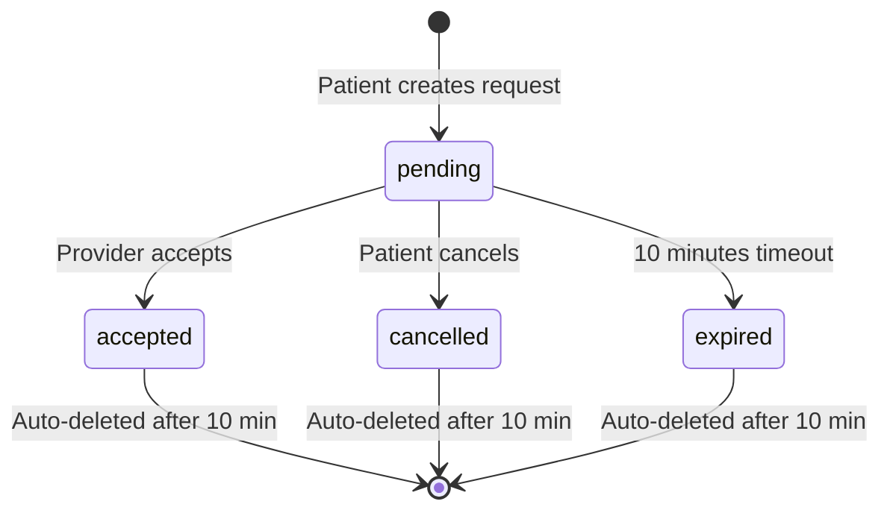

# Provider Requests Auto-Deletion (TTL)

## 📋 Overview
All documents in the `provider_requests` collection are automatically deleted **10 minutes** after creation. This ensures temporary booking requests don't accumulate in Firestore.

---

## 🗂️ Firestore Data Structure

### Collection: `provider_requests`

Each document represents a temporary booking request before an appointment is finalized.

```json
{
  "id": "auto-generated-doc-id",
  "patientId": "abc123xyz",
  "idpat": "abc123xyz",
  "providerId": "provider456",
  "service": "Consultation à domicile",
  "specialty": "Médecin généraliste",
  "prix": 150.0,
  "paymentMethod": "card",
  "patientLocation": {
    "_latitude": 33.5731,
    "_longitude": -7.5898
  },
  "status": "pending",
  "appointmentId": null,
  "createdAt": "2025-10-03T14:30:00.000Z",
  "updatedAt": "2025-10-03T14:30:00.000Z",
  "expireAt": "2025-10-03T14:40:00.000Z"  // ⏰ 10 minutes after creation
}
```

### Field Descriptions

| Field | Type | Description |
|-------|------|-------------|
| `patientId` | string | Patient's user ID (Firebase Auth UID) |
| `idpat` | string | Duplicate of patientId for legacy rule compatibility |
| `providerId` | string | Provider's user ID who will receive this request |
| `service` | string | Type of service requested (e.g., "Consultation à domicile") |
| `specialty` | string | Provider specialty (e.g., "Médecin généraliste", "Infirmière") |
| `prix` | number | Service price in local currency |
| `paymentMethod` | string | Payment method used ("card", "cash", etc.) |
| `patientLocation` | GeoPoint | Patient's current location (latitude/longitude) |
| `status` | string | Request status: `pending`, `accepted`, `cancelled`, `expired` |
| `appointmentId` | string\|null | Set when provider accepts and appointment is created |
| `createdAt` | Timestamp | When the request was created |
| `updatedAt` | Timestamp | Last modification time |
| **`expireAt`** | **Timestamp** | **⏰ When this document will be auto-deleted (createdAt + 10 minutes)** |

---

## ⚙️ How It Works

### 1. **Client-Side (Flutter)**
When a patient creates a request, the `expireAt` field is automatically added:

```dart
// services/provider_request_service.dart

final now = DateTime.now();
final expireAt = Timestamp.fromDate(now.add(const Duration(minutes: 10)));

final data = {
  'patientId': user.uid,
  'providerId': providerId,
  'service': service,
  // ... other fields ...
  'expireAt': expireAt, // ⏰ Auto-delete after 10 minutes
};
```

### 2. **Server-Side (Cloud Functions - Backup)**
A scheduled Cloud Function runs **every 5 minutes** as a backup to clean expired requests:

```typescript
// functions/src/index.ts

export const cleanupExpiredRequests = functions.pubsub
  .schedule("every 5 minutes")
  .onRun(async () => {
    const now = admin.firestore.Timestamp.now();
    
    const expiredSnapshot = await db.collection("provider_requests")
      .where("expireAt", "<=", now)
      .get();
    
    // Delete all expired documents
    const batch = db.batch();
    expiredSnapshot.docs.forEach((doc) => {
      batch.delete(doc.ref);
    });
    await batch.commit();
  });
```

### 3. **Firestore TTL (Recommended - Native Solution)**
Firestore can automatically delete documents when `expireAt` passes.

---

## 🔧 Enable Firestore TTL in Firebase Console

### Step-by-Step Instructions:

1. **Open Firebase Console**
   - Go to: https://console.firebase.google.com
   - Select your project: **nursinghomecare-1807f**

2. **Navigate to Firestore Database**
   - Click **Firestore Database** in the left sidebar
   - Select **Indexes** tab at the top

3. **Create TTL Policy**
   - Scroll down to **"Time-to-live (TTL)"** section
   - Click **"Create TTL policy"**

4. **Configure TTL**
   - **Collection ID**: `provider_requests`
   - **Field name**: `expireAt`
   - Click **"Create"**

5. **Wait for Activation**
   - TTL policies take **24-48 hours** to activate
   - Once active, documents will be automatically deleted when `expireAt` timestamp passes

### ⚠️ Important Notes:
- TTL policies delete documents **within 24 hours** after expiration (not instantly)
- The Cloud Function provides **immediate cleanup** (every 5 minutes)
- Both systems can coexist safely - they're idempotent

---

## 🎯 Workflow Example

### Timeline:

```
14:30:00 → Patient creates booking request
           ✅ Document created with expireAt = 14:40:00

14:32:00 → Provider accepts request
           ✅ Appointment created
           ✅ Request marked as "accepted"
           ⚠️ Document will still be deleted at 14:40:00

14:35:00 → Cloud Function runs (every 5 minutes)
           ℹ️ Document not expired yet (expireAt > now)

14:40:00 → Document expires
           ⏰ expireAt timestamp reached

14:40:01 → Cloud Function runs next cycle
           🗑️ Document deleted (expireAt <= now)
           ✅ Cleanup complete
```

### Status Flow:



---

## 🧹 Why Auto-Delete?

### Benefits:

1. **Reduce Storage Costs**
   - Temporary data doesn't accumulate indefinitely
   - Only active requests consume database space

2. **Improve Query Performance**
   - Fewer documents to scan when listening for pending requests
   - Faster real-time updates

3. **Data Hygiene**
   - Stale requests are automatically cleaned
   - No manual cleanup needed

4. **Privacy Compliance**
   - Temporary location data is automatically purged
   - Reduces data retention period

### Why 10 Minutes?

- Gives providers **reasonable time** to see and respond to requests
- Prevents **indefinite waiting** for patients
- Ensures **fast user experience** (patients won't wait forever)
- If request expires, patient can **try again** with another provider

---

## 🔍 Monitoring & Debugging

### Check Cloud Function Logs:

```bash
# View cleanup function logs
firebase functions:log --only cleanupExpiredRequests

# Expected output:
# ✅ Deleted 5 expired provider requests
# 🧹 No expired provider requests to clean up
```

### Query Expired Documents:

```dart
// Debug: Check for expired documents
final now = Timestamp.now();
final expired = await FirebaseFirestore.instance
    .collection('provider_requests')
    .where('expireAt', isLessThanOrEqualTo: now)
    .get();

print('Found ${expired.docs.length} expired requests');
```

### Verify TTL is Working:

1. Create a test request
2. Wait 10 minutes
3. Check if document still exists
4. If TTL is active, it will be gone within 24 hours
5. Cloud Function will delete it within 5 minutes

---

## 🛠️ Troubleshooting

### Documents Not Being Deleted?

**Check Cloud Function Status:**
```bash
firebase functions:log --only cleanupExpiredRequests --limit 10
```

**Verify expireAt Field Format:**
- Must be Firestore `Timestamp` type (not string)
- Should be in the future when created
- Check sample document structure

**Test Manually:**
```bash
# Check Cloud Scheduler
firebase functions:config:get
```

**Force Manual Cleanup:**
```dart
// Run in Firebase Console or Admin SDK
const now = admin.firestore.Timestamp.now();
const expired = await admin.firestore()
  .collection('provider_requests')
  .where('expireAt', '<=', now)
  .get();

const batch = admin.firestore().batch();
expired.docs.forEach(doc => batch.delete(doc.ref));
await batch.commit();
```

---

## 📊 Cost Impact

### Storage Savings:
- Average request size: ~500 bytes
- Average requests/day: 100
- Without TTL: 36,500 requests/year * 500 bytes = **18.25 MB/year**
- With TTL: Only active requests (10 min window) = **~35 KB average**

### Function Costs:
- **cleanupExpiredRequests** runs every 5 minutes
- ~8,640 invocations/month
- Firebase Free Tier: 2,000,000 invocations/month (way more than enough!)

---

## ✅ Summary

| Feature | Status | Details |
|---------|--------|---------|
| **Auto-Expiration** | ✅ Implemented | `expireAt` field added to all requests |
| **Cloud Function Cleanup** | ✅ Deployed | Runs every 5 minutes |
| **Firestore TTL** | ⚠️ Manual Setup Required | Enable in Firebase Console |
| **Data Structure** | ✅ Documented | See structure above |

### Next Steps:
1. ✅ Code deployed (already done)
2. ⚠️ Enable Firestore TTL in Firebase Console (follow guide above)
3. ✅ Monitor logs to verify cleanup is working
4. ✅ Test with real requests after 10 minutes

---

## 📞 Support

If documents are still not being deleted after 48 hours:
1. Check Firebase Console → Functions → Logs
2. Verify TTL policy is active
3. Ensure `expireAt` field is Timestamp type (not string)
4. Check Firestore rules allow deletions

**Happy Coding! 🚀**
