# Healthcare Database Schema Visualization

## Entity Relationship Diagram (ERD)

```mermaid
erDiagram
    %% Users & Authentication
    User ||--|| UserProfile : "has"
    UserProfile ||--o{ HealthcareProvider : "can be"
    
    %% Healthcare Services
    HealthcareProvider }o--o{ Specialty : "specializes in"
    Specialty ||--o{ ServiceCategory : "belongs to"
    
    %% Location & Pricing
    City ||--o{ UserProfile : "located in"
    PricingRule }o--|| Specialty : "applies to"
    
    %% Appointments & Bookings
    UserProfile ||--o{ Appointment : "books"
    HealthcareProvider ||--o{ Appointment : "provides"
    Specialty ||--o{ Appointment : "for"
    Appointment ||--o{ AppointmentStatusHistory : "has history"
    
    %% Real-time Tracking
    HealthcareProvider ||--o{ ProviderLocation : "tracks"
    Appointment ||--o| TrackingSession : "has"
    TrackingSession ||--o{ ProviderLocation : "contains"
    
    %% Chat & Communication
    Appointment ||--|| Conversation : "has"
    Conversation ||--o{ Message : "contains"
    Message ||--o{ MessageReadStatus : "read by"
    
    %% Notifications
    UserProfile ||--o{ Notification : "receives"
    UserProfile ||--o{ PushToken : "has"
    
    %% Reviews & Ratings
    Appointment ||--o| Review : "can have"
    Review ||--o| ReviewResponse : "can have"
    
    %% Payments
    UserProfile ||--o{ PaymentMethod : "has"
    Appointment ||--|| Payment : "requires"
    PaymentMethod ||--o{ Payment : "used for"
    
    %% System & Analytics
    UserProfile ||--o{ AnalyticsEvent : "generates"
    HealthcareProvider ||--o{ ProviderAvailability : "has"

    %% Entity Definitions
    User {
        int id PK
        string username
        string email
        string password
        datetime created_at
    }
    
    UserProfile {
        int id PK
        int user_id FK
        string phone_number
        date date_of_birth
        string gender
        text address
        string city
        string province
        decimal latitude
        decimal longitude
        string profile_picture
        boolean is_verified
        datetime created_at
        datetime updated_at
    }
    
    HealthcareProvider {
        int id PK
        int user_id FK
        string provider_type
        string license_number
        int experience_years
        decimal rating
        int total_reviews
        decimal consultation_fee
        boolean is_available
        boolean is_verified
        text bio
        text education
        text certifications
        datetime created_at
        datetime updated_at
    }
    
    Specialty {
        int id PK
        string name
        text description
        string category
        string icon
        int average_consultation_time
        boolean is_active
        datetime created_at
        datetime updated_at
    }
    
    ServiceCategory {
        int id PK
        string name
        text description
        datetime created_at
        datetime updated_at
    }
    
    City {
        int id PK
        string name
        string province
        decimal latitude
        decimal longitude
        int population
        boolean is_capital
        boolean is_active
        datetime created_at
        datetime updated_at
    }
    
    PricingRule {
        int id PK
        string service_type
        int specialty_id FK
        decimal base_price
        decimal per_km_rate
        decimal peak_hour_multiplier
        decimal service_fee_percentage
        string currency
        boolean is_active
        datetime created_at
        datetime updated_at
    }
    
    Appointment {
        int id PK
        int patient_id FK
        int provider_id FK
        int specialty_id FK
        date appointment_date
        time appointment_time
        string status
        text patient_address
        decimal patient_latitude
        decimal patient_longitude
        decimal distance_km
        decimal base_price
        decimal travel_fee
        decimal service_fee
        decimal total_price
        string payment_status
        text notes
        datetime created_at
        datetime updated_at
    }
    
    AppointmentStatusHistory {
        int id PK
        int appointment_id FK
        string status
        int changed_by_id FK
        text notes
        datetime timestamp
    }
    
    ProviderLocation {
        int id PK
        int provider_id FK
        int appointment_id FK
        decimal latitude
        decimal longitude
        decimal accuracy
        decimal heading
        decimal speed
        boolean is_active
        datetime timestamp
    }
    
    TrackingSession {
        int id PK
        int appointment_id FK
        int provider_id FK
        int patient_id FK
        datetime started_at
        datetime ended_at
        string status
        datetime estimated_arrival
        datetime actual_arrival
    }
    
    Conversation {
        int id PK
        int appointment_id FK
        int patient_id FK
        int provider_id FK
        boolean is_active
        datetime created_at
        datetime updated_at
    }
    
    Message {
        int id PK
        int conversation_id FK
        int sender_id FK
        string message_type
        text content
        string image_url
        string file_url
        decimal latitude
        decimal longitude
        json metadata
        boolean is_read
        datetime sent_at
        datetime read_at
    }
    
    MessageReadStatus {
        int id PK
        int message_id FK
        int user_id FK
        datetime read_at
    }
    
    Notification {
        int id PK
        int user_id FK
        string title
        text message
        string notification_type
        int related_object_id
        string related_object_type
        boolean is_read
        boolean is_sent
        datetime scheduled_at
        datetime sent_at
        datetime created_at
    }
    
    PushToken {
        int id PK
        int user_id FK
        string token
        string platform
        boolean is_active
        datetime created_at
        datetime updated_at
    }
    
    Review {
        int id PK
        int appointment_id FK
        int patient_id FK
        int provider_id FK
        int rating
        text comment
        boolean is_anonymous
        boolean is_approved
        datetime created_at
        datetime updated_at
    }
    
    ReviewResponse {
        int id PK
        int review_id FK
        int provider_id FK
        text response_text
        datetime created_at
    }
    
    PaymentMethod {
        int id PK
        int user_id FK
        string method_type
        string card_last_four
        string card_brand
        boolean is_default
        boolean is_active
        datetime created_at
        datetime updated_at
    }
    
    Payment {
        int id PK
        int appointment_id FK
        int user_id FK
        decimal amount
        string currency
        int payment_method_id FK
        string transaction_id
        string status
        string payment_gateway
        json gateway_response
        datetime paid_at
        datetime created_at
        datetime updated_at
    }
    
    AnalyticsEvent {
        int id PK
        int user_id FK
        string event_type
        json event_data
        string session_id
        string ip_address
        string user_agent
        datetime timestamp
    }
    
    ProviderAvailability {
        int id PK
        int provider_id FK
        int day_of_week
        time start_time
        time end_time
        boolean is_available
        datetime created_at
        datetime updated_at
    }
```



## Database Architecture Overview

### Core Modules:

1. **👤 User Management**
   - User authentication & profiles
   - Healthcare provider registration
   - Role-based access control

2. **🏥 Healthcare Services**
   - Medical specialties management
   - Service categorization
   - Provider-specialty relationships

3. **📍 Location & Pricing**
   - Algerian cities database
   - Distance-based pricing rules
   - Geographic calculations

4. **📅 Booking System**
   - Appointment scheduling
   - Status tracking
   - History management

5. **🗺️ Real-time Tracking**
   - Live location updates
   - Provider tracking sessions
   - ETA calculations

6. **💬 Communication**
   - Chat conversations
   - Message management
   - Read status tracking

7. **🔔 Notifications**
   - Push notifications
   - System alerts
   - Device token management

8. **⭐ Reviews & Ratings**
   - Patient feedback
   - Provider responses
   - Rating aggregation

9. **💳 Payment Processing**
   - Payment methods
   - Transaction tracking
   - Financial records

10. **📊 Analytics & System**
    - User behavior tracking
    - Provider availability
    - System configuration

## Key Relationships:

- **One-to-One**: User ↔ UserProfile, Appointment ↔ Payment
- **One-to-Many**: Provider → Appointments, Conversation → Messages
- **Many-to-Many**: Provider ↔ Specialties
- **Polymorphic**: Notifications (can relate to any entity)

## Indexes & Performance:

```sql
-- Critical indexes for performance
CREATE INDEX idx_appointment_patient_date ON Appointment(patient_id, appointment_date);
CREATE INDEX idx_appointment_provider_status ON Appointment(provider_id, status);
CREATE INDEX idx_provider_location_timestamp ON ProviderLocation(provider_id, timestamp);
CREATE INDEX idx_message_conversation_sent ON Message(conversation_id, sent_at);
CREATE INDEX idx_notification_user_read ON Notification(user_id, is_read);
```

## Data Flow:

1. **Booking Flow**: User → Specialty → Provider → Appointment → Payment
2. **Communication Flow**: Appointment → Conversation → Messages
3. **Tracking Flow**: Appointment → TrackingSession → ProviderLocation
4. **Notification Flow**: System Events → Notifications → PushTokens

This schema supports all features in your Flutter healthcare app with optimal performance and scalability.